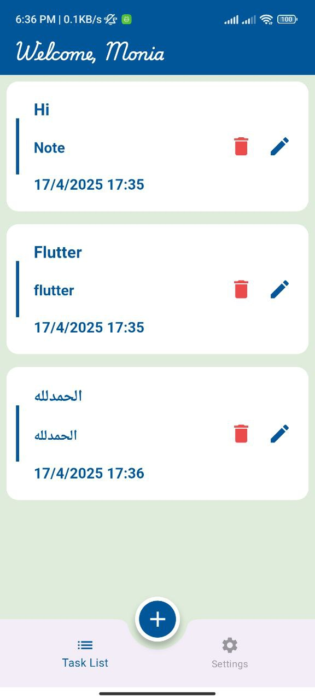
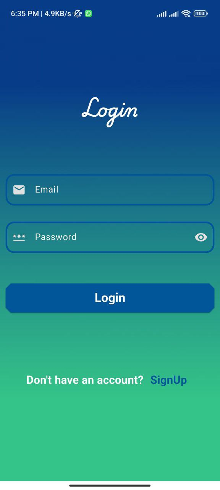
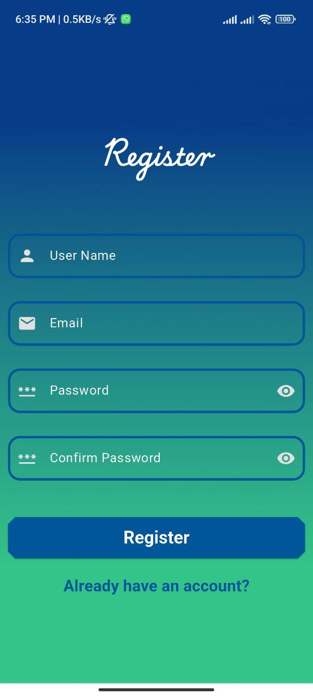
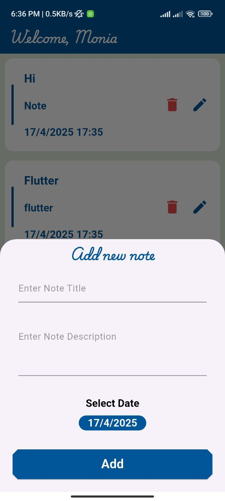
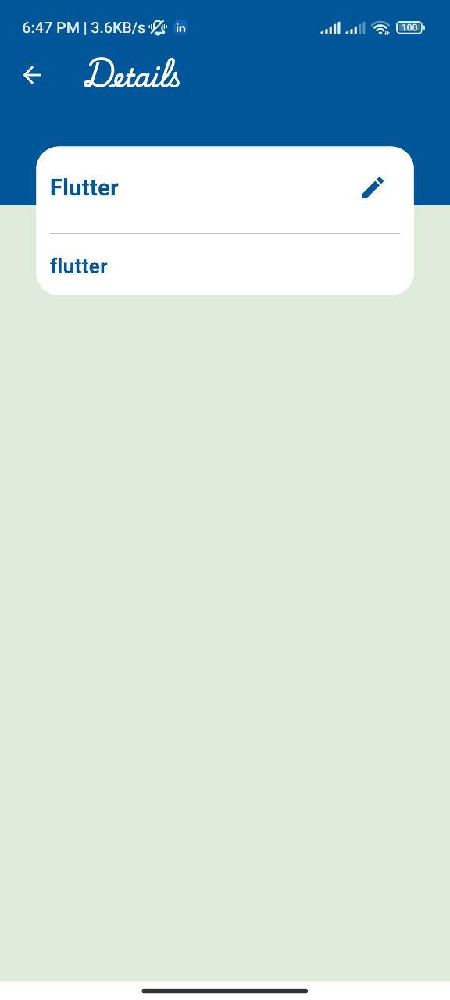
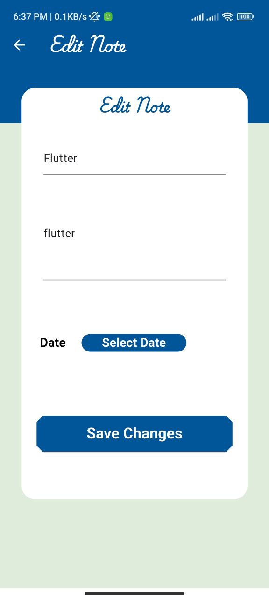
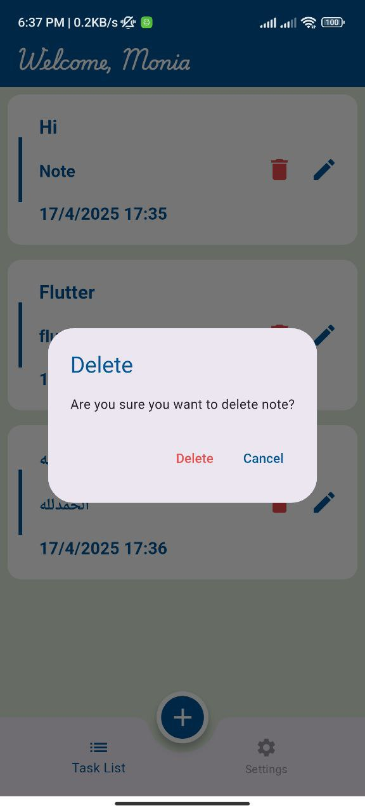
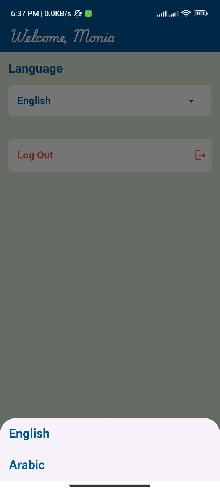
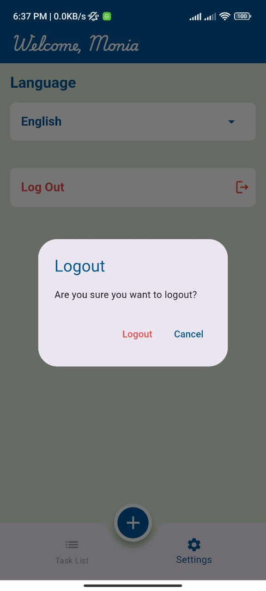

# 🗒️ Notely - Notes App

A simple and clean Notes application built with **Flutter**, integrated with **Firebase
Authentication** and **Cloud Firestore** for secure and real-time note storage. The app allows users
to create, update, and view their notes with timestamps. It also supports **language switching** and
uses **Cubit** for state management.

---

## 🚀 Features

- 🔐 **User Authentication**  
  Sign in and sign out securely using Firebase Authentication.

- 🕒 **Add Notes with Timestamps**  
  Notes are saved with the **current date and time** (day, month, hour).

- ✏️ **Edit & View Notes**  
  Easily **edit** any saved note and **view** it in full detail.

- 🌐 **Multilingual Support**  
  Switch between **languages** within the app.

- ⚙️ **State Management with Cubit**  
  Clean architecture and state handling using **Cubit** from `flutter_bloc`.

---

## 🧰 Technologies Used

- **Flutter**
- **Firebase Authentication**
- **Cloud Firestore**
- **Cubit (flutter_bloc)**
- **Intl** – for date/time formatting and localization

---

## 📸 Screenshots

| Home Screen                            | Login Screen                             | Register Screen                              | Add Note                           | View Note                            |
|----------------------------------------|------------------------------------------|----------------------------------------------|------------------------------------|--------------------------------------|
|  |  |  |  |  |

| Edit Note                            | Delete Note                              | Change Language                                  | Logout                              |
|--------------------------------------|------------------------------------------|--------------------------------------------------|-------------------------------------|
|  |  |  |  |
---

## 🛠️ Getting Started

1. **Clone the repo:**
   ```bash
   git clone https://github.com/MoNia1126/Notely.git

## 📬 Contact

For any questions or feedback, feel free to reach out on  
[LinkedIn](https://www.linkedin.com/in/moniamohamed/) 💬
